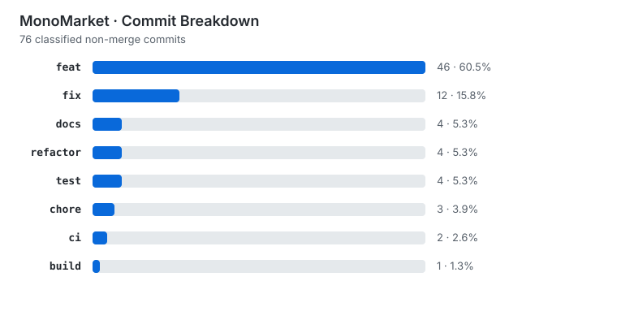

<div align="center">

# Nguyen Gia Huy

### Backend-focused IT Student · Java / Spring Boot

<p>
  
</p>

</div>

```java
public class NguyenGiaHuy {
    String focus = "Backend Engineering";
    String university = "UIT - VNUHCM";
    String mainStack = "Java / Spring Boot / PostgreSQL";
    String building = "MonoMarket";
    String direction = "Software Engineering in Japan";
}
```

## About me

I am an IT student at the University of Information Technology, VNU-HCM (UIT), with backend development as my main direction. Java, Spring Boot, and PostgreSQL are the stack I use most while building MonoMarket.

I am interested in what happens below an endpoint: relational database state, transactions, consistency, tests, containers, and deployment. When a feature fails, I usually trace the logs and database state before changing the design.

I am also studying Japanese for future software engineering opportunities in Japan.

**Languages:** Vietnamese — Native · English — IELTS 7.0 · Japanese — Currently studying toward professional use

## Featured project

<div align="center">
  <a href="https://github.com/myngh04/monomarket">
    
  </a>
</div>

MonoMarket is a server-rendered second-hand e-commerce platform inspired by Japanese reuse stores. It uses Spring Boot, Spring MVC, Thymeleaf, PostgreSQL, Hibernate/JPA, Spring Security, Flyway, Maven, Docker Compose, GitHub Actions, MockMvc, Mockito, H2, and Swagger/OpenAPI.

| Engineering area     | Implementation focus                                                                                       |
| :------------------- | :--------------------------------------------------------------------------------------------------------- |
| Cart state           | Guest carts merge into the authenticated user's cart after login.                                          |
| Inventory and orders | Serialized inventory represents unique stock; checkout and cancellation keep reservation state consistent. |
| Database             | PostgreSQL schema changes are versioned with Flyway migrations and modeled through relational entities.    |
| Testing              | Spring Boot tests use MockMvc, Mockito, and H2 to exercise web and application behavior.                   |
| Local delivery       | Docker and Docker Compose run the application with PostgreSQL; GitHub Actions runs Maven verification.     |
| Web architecture     | Spring MVC and Thymeleaf keep the customer flow server-rendered.                                           |

## Toolbox

<div align="center">

|      IDE / Editor       | Database | API testing | Containers | AI-assisted development | Version control |
| :---------------------: | :------: | :---------: | :--------: | :---------------------: | :-------------: |
| IntelliJ IDEA · VS Code | DBeaver  |   Postman   |   Docker   |          Codex          |       Git       |

</div>

## Engineering activity

<div align="center">
  <a href="https://github.com/myngh04/monomarket">
    
  </a>
</div>

<sub>Generated from non-merge MonoMarket commit subjects. Only recognized Conventional Commit types are included.</sub>
